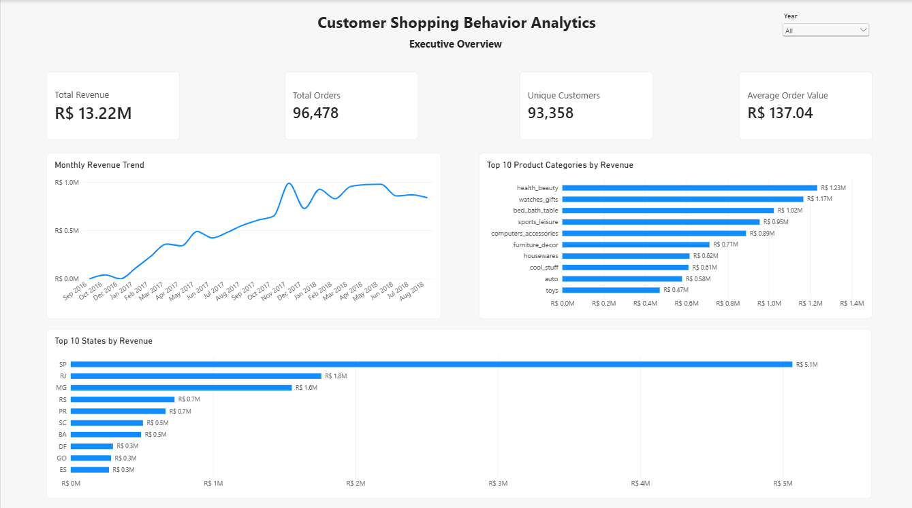
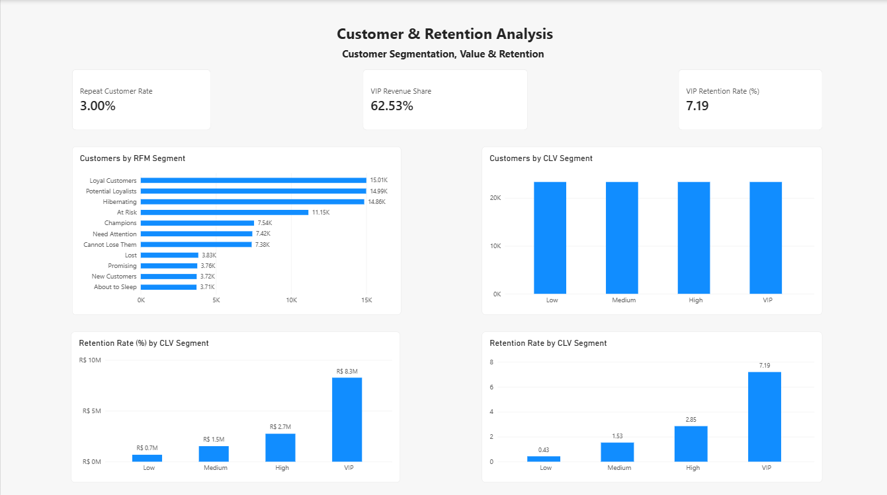
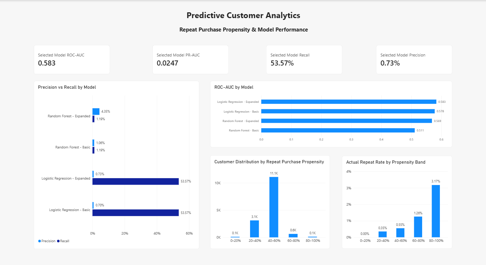

# Customer Shopping Behavior Analytics

## Overview

This project analyzes customer shopping behavior using the **Brazilian
E-Commerce Public Dataset by Olist**. The goal is to move beyond basic
sales reporting and build an end-to-end customer analytics workflow that
explains business performance, identifies valuable customer groups,
evaluates retention, and explores whether future repeat purchasing can
be predicted.

The project combines **Python/Jupyter Notebook** for data preparation,
exploratory analysis, customer analytics, and machine learning with
**Power BI** for interactive business reporting.

The analysis progresses through six stages:

1.  Data understanding and validation
2.  Exploratory data analysis
3.  RFM customer segmentation
4.  Customer lifetime value analysis
5.  Customer retention and cohort analysis
6.  Predictive modeling for future repeat purchases

------------------------------------------------------------------------

## Business Questions

The project was designed to answer the following questions:

-   How much revenue does the marketplace generate, and how does
    performance change over time?
-   Which product categories and geographic markets contribute the most
    revenue?
-   How concentrated is revenue among customers?
-   Which customers are the most engaged and valuable?
-   How does customer value differ across RFM and CLV segments?
-   How strong is customer retention?
-   Are high-value customers more likely to make repeat purchases?
-   Can historical customer behavior help identify customers who are
    more likely to purchase again?
-   How can predictive scores be used responsibly for retention
    targeting?

------------------------------------------------------------------------

## Dataset

This project uses the **Brazilian E-Commerce Public Dataset by Olist**,
a public e-commerce dataset containing approximately 100,000 marketplace
orders from 2016 to 2018.

The analysis uses information from:

-   Customers
-   Orders
-   Order items
-   Payments
-   Reviews
-   Products
-   Sellers
-   Product category translations

### Download

The dataset is publicly available on Kaggle:

[**Brazilian E-Commerce Public Dataset by
Olist**](https://www.kaggle.com/datasets/olistbr/brazilian-ecommerce)

After downloading the dataset, place the required CSV files inside the
local `data/` directory.

The raw dataset is not included in this repository to keep the
repository lightweight and avoid duplicating a publicly available
dataset.

------------------------------------------------------------------------

## Tools and Technologies

-   **Python**
-   **Jupyter Notebook**
-   **pandas**
-   **NumPy**
-   **Matplotlib**
-   **scikit-learn**
-   **Power BI**
-   **DAX**
-   **Power Query**

------------------------------------------------------------------------

## Project Workflow

### 1. Data Understanding

The first notebook examines the structure and quality of the Olist
tables before analysis.

Key tasks include:

-   Inspecting dataset dimensions and columns
-   Evaluating missing values
-   Understanding relationships between tables
-   Distinguishing `customer_id` from `customer_unique_id`
-   Investigating order status and customer purchase behavior
-   Converting order timestamps to datetime values

A key modeling decision was to use `customer_unique_id` for
customer-level analysis because `customer_id` identifies an
order-specific customer record rather than a persistent customer across
purchases.

------------------------------------------------------------------------

### 2. Exploratory Data Analysis

The exploratory analysis focuses on marketplace performance, product
performance, geography, and customer behavior.

#### Executive KPIs

  Metric                      Result
  --------------------- ------------
  Revenue                 R\$ 13.22M
  Delivered Orders            96,478
  Unique Customers            93,358
  Average Order Value     R\$ 137.04

#### Key Findings

-   Revenue growth was driven primarily by increasing order volume
    rather than substantial growth in average order value.
-   The **top 10 product categories generated 63.22% of revenue**.
-   The **top 3 states generated 63.38% of revenue**, showing strong
    geographic concentration.
-   The **top 10% of customers generated 41.10% of revenue**.
-   Only about **3.00% of customers made more than one purchase**,
    revealing a major retention challenge.

------------------------------------------------------------------------

### 3. RFM Customer Segmentation

RFM analysis was used to segment customers based on:

-   **Recency** --- how recently the customer purchased
-   **Frequency** --- how often the customer purchased
-   **Monetary value** --- how much the customer spent

Customers were assigned to behavioral segments including:

-   Champions
-   Loyal Customers
-   Potential Loyalists
-   New Customers
-   Promising
-   Need Attention
-   About to Sleep
-   At Risk
-   Cannot Lose Them
-   Hibernating
-   Lost

#### Key Findings

-   **Loyal Customers** were the largest RFM segment, with approximately
    15,005 customers.
-   **Potential Loyalists** and **Hibernating** customers were also
    major groups.
-   **Champions** had the highest average customer value.
-   Loyal Customers contributed approximately **16.52% of total
    revenue**.

The segmentation provides a practical framework for differentiated
customer engagement rather than treating the entire customer base as one
group.

------------------------------------------------------------------------

### 4. Customer Lifetime Value Analysis

Historical customer lifetime value was defined as each customer's
realized marketplace revenue during the available observation period.

Customers were divided into four value quartiles:

  CLV Segment     Customers   Average CLV   Revenue Share
  ------------- ----------- ------------- ---------------
  Low                23,341     R\$ 29.10           5.14%
  Medium             23,338     R\$ 65.43          11.55%
  High               23,339    R\$ 117.74          20.78%
  VIP                23,340    R\$ 354.22          62.53%

#### Key Finding

Although each CLV segment contains approximately one quarter of
customers, the **VIP segment generates 62.53% of total customer
revenue**.

This demonstrates substantial customer-value concentration and provides
a strong business case for prioritizing high-value customers in
retention and engagement strategies.

------------------------------------------------------------------------

### 5. Customer Retention Analysis

Cohort analysis was used to evaluate whether customers returned in later
months after their first purchase.

#### Key Findings

-   Monthly retention after the first purchase was generally **below 1%
    across cohorts**.
-   The marketplace therefore exhibits very weak repeat-purchase
    behavior.
-   Retention increases substantially with customer value.

  CLV Segment     Retention Rate
  ------------- ----------------
  Low                      0.43%
  Medium                   1.53%
  High                     2.85%
  VIP                      7.19%

VIP customers were more than **16 times as likely to repeat as Low-value
customers**.

This reinforces the importance of protecting and engaging high-value
customers while also highlighting the broader marketplace retention
challenge.

------------------------------------------------------------------------

## Predictive Modeling

The final analytical stage evaluates whether historical customer
behavior can help identify customers who will make a future purchase.

### Leakage-Safe Time Window

To prevent future information from entering the model:

-   **Observation period:** September 2016 -- May 2018
-   **Prediction period:** June 2018 -- August 2018

A customer was labeled:

-   `1` if they purchased again during the prediction period
-   `0` otherwise

Repeat purchasing represented only **0.56% of the modeling population**,
creating an extremely imbalanced classification problem.

### Features

Initial customer features included:

-   Recency
-   Frequency
-   Monetary value
-   Average order value
-   Customer tenure

The expanded feature set also included:

-   Total items purchased
-   Total freight expenditure
-   Number of unique products
-   Number of unique sellers

All predictor features were calculated exclusively from transactions
occurring before the prediction period.

### Model Comparison

Logistic Regression and Random Forest were evaluated using both basic
and expanded feature sets.

  -----------------------------------------------------------------------------
  Model             ROC-AUC       PR-AUC    Precision       Recall           F1
  ------------ ------------ ------------ ------------ ------------ ------------
  Logistic            0.578       0.0241        0.70%       53.57%       0.0137
  Regression                                                       
  --- Basic                                                        

  Random              0.511       0.0061        1.06%        1.19%       0.0112
  Forest ---                                                       
  Basic                                                            

  **Logistic      **0.583**   **0.0247**        0.73%   **53.57%**       0.0145
  Regression                                                       
  ---                                                              
  Expanded**                                                       

  Random              0.569       0.0103    **4.35%**        1.19%   **0.0187**
  Forest ---                                                       
  Expanded                                                         
  -----------------------------------------------------------------------------

The **Expanded Logistic Regression** model was selected for
interpretation because it provided the strongest overall ranking
performance while recovering a substantially larger proportion of repeat
customers than the Random Forest models.

### Model Interpretation

The most important predictive relationships were:

-   **Recency** was the strongest predictor: customers whose latest
    purchase was further in the past were less likely to return during
    the prediction period.
-   **Customer tenure** was also important, with longer-established
    customers showing a greater likelihood of returning.
-   **Total items purchased** showed a positive association with future
    repeat purchasing.
-   **Higher freight expenditure** showed a smaller negative association
    with repeat purchasing.

These relationships are predictive associations and should not be
interpreted as causal effects.

### Responsible Use of the Model

The model's low precision means it should **not** be used as a
high-confidence automatic repeat-customer classifier.

Instead, the propensity score is more appropriate for **ranking and
prioritizing customers** for targeted retention initiatives.

The Power BI analysis supports this interpretation: actual repeat rates
increased across higher propensity-score bands.

  Propensity Band     Actual Repeat Rate
  ----------------- --------------------
  0--20%                           0.00%
  20--40%                          0.35%
  40--60%                          0.55%
  60--80%                          1.26%
  80--100%                         3.17%

Because balanced class weights were used during model training, these
propensity scores are used primarily for **relative customer ranking**,
not as calibrated purchase probabilities.

------------------------------------------------------------------------

## Power BI Dashboard

The final Power BI dashboard contains three pages that move from
descriptive analytics to customer analytics and predictive insights.

### Page 1 --- Executive Overview

Provides a high-level view of marketplace performance through:

-   Total revenue
-   Delivered orders
-   Unique customers
-   Average order value
-   Monthly revenue trend
-   Top product categories by revenue
-   Top states by revenue
-   Year filtering



### Page 2 --- Customer & Retention Analysis

Focuses on customer value, segmentation, and retention:

-   Repeat customer rate
-   VIP revenue share
-   VIP retention rate
-   Customers by RFM segment
-   Customers by CLV segment
-   Revenue by CLV segment
-   Retention rate by CLV segment



### Page 3 --- Predictive Analytics

Summarizes repeat-purchase modeling and customer prioritization:

-   Selected model ROC-AUC
-   Selected model PR-AUC
-   Selected model recall
-   Selected model precision
-   Precision vs. recall comparison
-   ROC-AUC comparison
-   Customer propensity distribution
-   Actual repeat rate by propensity band



> **Note:** The original Power BI `.pbix` file is not included in this
> repository because it exceeds GitHub's standard file-size limit.
> Dashboard screenshots are provided above, and additional information
> is available in the `dashboard/` folder.

------------------------------------------------------------------------

## Business Recommendations

The combined analysis suggests several practical actions:

1.  **Prioritize retention among high-value customers.**\
    VIP customers generate 62.53% of revenue and have the highest
    observed retention rate.

2.  **Engage customers while they are still recent.**\
    Recency was the strongest predictor of future repeat purchasing,
    suggesting that retention campaigns should occur before customer
    engagement fades.

3.  **Develop segment-specific retention strategies.**\
    Champions, Loyal Customers, At Risk customers, and Hibernating
    customers represent different levels of value and engagement and
    should not receive identical messaging.

4.  **Encourage broader purchasing behavior.**\
    Customers purchasing more items showed a stronger association with
    future repeat purchasing. Cross-selling and relevant recommendations
    may therefore support engagement.

5.  **Evaluate shipping-cost interventions.**\
    Higher freight expenditure was negatively associated with
    repeat-purchase likelihood. Shipping promotions or threshold-based
    free shipping could be tested among suitable customer groups.

6.  **Use predictive scores for prioritization rather than automatic
    classification.**\
    The predictive model has limited classification precision. Its
    strongest use case is ranking customers for targeted campaigns,
    followed by controlled campaign testing to determine whether
    targeting produces incremental business value.

------------------------------------------------------------------------

## Key Takeaways

The project highlights three major business themes:

**Revenue is concentrated.**\
A relatively small share of products, geographic markets, and high-value
customers contributes a large share of marketplace revenue.

**Customer retention is the central challenge.**\
Only about 3% of customers purchase more than once, and monthly cohort
retention is generally below 1%.

**Customer value and repeat behavior are connected.**\
VIP customers show substantially higher retention, and predictive
modeling provides some ability to rank customers by future
repeat-purchase propensity, although the available transaction history
is not sufficient for highly accurate individual classification.

------------------------------------------------------------------------

## Repository Structure

``` text
Customer_Shopping_Behavior_Analytics/
│
├── notebooks/
│   ├── 01_Data_Understanding.ipynb
│   ├── 02_Exploratory_Data_Analysis.ipynb
│   ├── 03_Customer_Segmentation_RFM.ipynb
│   ├── 04_Customer_Lifetime_Value.ipynb
│   ├── 05_Customer_Retention_Analysis.ipynb
│   └── 06_Predictive_Modeling.ipynb
│
├── outputs/
│   ├── rfm_segments.csv
│   ├── customer_clv.csv
│   ├── retention_analysis.csv
│   ├── customer_predictions.csv
│   └── model_performance.csv
│
├── dashboard/
│   └── README.md
│
├── images/
│   ├── executive_overview.png
│   ├── customer_retention.png
│   └── predictive_analytics.png
│
├── .gitignore
└── README.md
```

The local project also contains the raw `data/` directory and Power BI
`.pbix` file. These are excluded from GitHub through `.gitignore`.

------------------------------------------------------------------------

## Notebook Guide

  ----------------------------------------------------------------------------
  Notebook                                 Purpose
  ---------------------------------------- -----------------------------------
  `01_Data_Understanding.ipynb`            Dataset structure, relationships,
                                           missingness, and data-quality
                                           assessment

  `02_Exploratory_Data_Analysis.ipynb`     Business KPIs, trends, product,
                                           geographic, and customer analysis

  `03_Customer_Segmentation_RFM.ipynb`     Recency, Frequency, Monetary
                                           scoring and behavioral segmentation

  `04_Customer_Lifetime_Value.ipynb`       Historical customer value and CLV
                                           segmentation

  `05_Customer_Retention_Analysis.ipynb`   Cohort retention and retention
                                           differences across CLV segments

  `06_Predictive_Modeling.ipynb`           Leakage-safe future repeat-purchase
                                           modeling and propensity scoring
  ----------------------------------------------------------------------------

------------------------------------------------------------------------

## Reproducing the Analysis

1.  Clone this repository.
2.  Download the Olist dataset from Kaggle.
3.  Create a `data/` directory in the project root.
4.  Place the required Olist CSV files inside `data/`.
5.  Install the required Python packages.
6.  Run the notebooks sequentially from `01` through `06`.

Example installation:

``` bash
pip install pandas numpy matplotlib scikit-learn jupyter
```

The notebooks save processed analytical outputs to the `outputs/`
directory for downstream analysis and dashboard development.

------------------------------------------------------------------------

## Limitations

-   The Olist dataset covers a historical period from 2016 to 2018 and
    should not be interpreted as current marketplace performance.
-   Historical CLV represents realized customer revenue during the
    available observation period rather than a forecast of future
    lifetime value.
-   Repeat purchasing is extremely rare in the predictive modeling
    population, limiting classification performance.
-   The predictive model identifies associations in historical customer
    behavior and does not establish causal relationships.
-   Propensity scores are intended primarily for ranking customers and
    are not presented as calibrated purchase probabilities.
-   External factors such as marketing exposure, competitor activity,
    customer acquisition channels, and broader economic conditions are
    not available in the dataset.

------------------------------------------------------------------------

## Author

**Chidera Amadike**

Data Science & Analytics\
Toronto, Canada

[GitHub](https://github.com/deralili)

------------------------------------------------------------------------

## Project Status

**Completed**

The final project includes exploratory analysis, customer segmentation,
historical customer value analysis, retention analysis, leakage-safe
predictive modeling, and a three-page Power BI dashboard.
